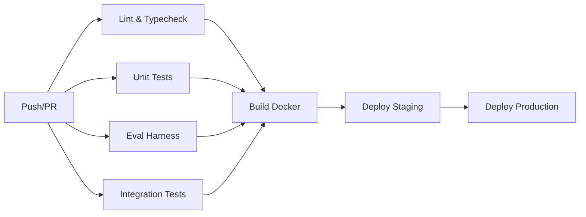

# VAJRA - Multi-Agent Defense System for Payment Risk

> **Razorpay AI Buildathon - Track 2: AI Risk Manager**

VAJRA is a production-grade, multi-agent defense system that protects merchants from fraud, chargebacks, and revenue loss through novel AI architectures: **multi-agent tribunal debate**, **neuro-symbolic causal fraud graphs**, and **program-synthesized executable defense policies**.

## Architecture Overview

```
┌─────────────────────────────────────────────────────────────────┐
│                        EVENT INGESTION                          │
│  Razorpay Webhooks → Kafka → Feature Store (Redis/ClickHouse)   │
└─────────────────────────┬───────────────────────────────────────┘
                          │
            ┌─────────────┼─────────────┐
            ▼             ▼             ▼
    ┌───────────────┐ ┌───────────────┐ ┌───────────────┐
    │ FRAUD VAJRA│ │CHARGEBACK DEF │ │  AUDIT LEDGER │
    │               │ │               │ │               │
    │ • Causal KG   │ │ • Tribunal    │ │ • Immutable   │
    │ • Counterfact │ │   Engine      │ │ • Query API   │
    │ • Ring Detect │ │ • Policy Synth│ │ • Compliance  │
    └───────┬───────┘ └───────┬───────┘ └───────┬───────┘
            │                 │                 │
            └─────────────────┼─────────────────┘
                              ▼
                  ┌───────────────────────┐
                  │   POLICY EXECUTOR     │
                  │ (Bounded workflows,   │
                  │  circuit breakers,    │
                  │  human escalation)    │
                  └───────────────────────┘
```

## Key Innovations

### 1. Tribunal Engine (Multi-Agent Debate)
- **Prosecutor Agent**: Builds merchant's case citing evidence
- **Defense Agent**: Builds cardholder's case identifying weaknesses
- **Judge Agent**: Renders binding ruling with confidence, cost-awareness, and deadlines
- Structured argumentation with citation tracking — not free-form chat
- **LLM with automatic fallback**: Real OpenAI → mock on quota/rate-limit/network errors (zero-downtime)

### 2. Causal Fraud Graph (Neuro-Symbolic)
- Knowledge graph of entities (users, devices, IPs, cards, merchants)
- GNN embeddings + Datalog rules for ring detection
- Counterfactual reasoning: "Would this be fraud without this device?"
- Outputs **causal explanations**, not just scores

### 3. Policy Synthesis (Executable DSL)
- Converts tribunal rulings into verifiable, bounded workflows
- DSL with static verification (deadlines, bounds, completeness)
- Formal verification via Z3 for critical properties
- Immutable audit trail for every execution step

### 4. Eval Harness (CI-Gated)
- Automated regression suite for every agent
- Precision/recall/latency/cost gates in CI
- Synthetic + labeled datasets with adversarial tests
- MLflow tracking for experiment reproducibility

### 5. LLM Abstraction with Zero-Downtime Fallback
- **OpenAIClient**: Real GPT-4o-mini when credits available
- **MockLLMClient**: Deterministic, zero-latency, zero-cost fallback
- **Auto-fallback**: Quota exhausted → 429 → network error → auto-switch to mock
- **Zero config**: Add `OPENAI_API_KEY` to `.env` for real LLM; works without it

## Quick Start

### Prerequisites
- Python 3.11+
- PostgreSQL 14+ (via `brew install postgresql@18` or Docker)
- OpenAI API key (optional — works fully mocked)

### Local Development (No Docker Required)

```bash
# Clone and setup
cd vajra
cp .env.example .env
# Edit .env — add OPENAI_API_KEY for real LLM (optional)

# Start PostgreSQL (macOS)
brew services start postgresql@18
createuser -s vajra 2>/dev/null || true
createdb vajra 2>/dev/null || true

# Install dependencies
pip install -e ".[dev]"

# Initialize database
python -c "import asyncio; from vajra.core.database import init_db; asyncio.run(init_db())"

# Run API server
python -m vajra
# → http://localhost:8000/docs (Swagger UI)
```

### With Docker (Full Stack)
```bash
docker-compose up -d postgres redis clickhouse kafka zookeeper
# Then run API as above
```

### Run Evaluations
```bash
# Generate synthetic datasets
python -m vajra.eval.generate_datasets

# Run chargeback defender eval
python -m vajra.eval.run_chargeback_eval

# Run fraud vajra eval
python -m vajra.eval.run_fraud_eval

# Check CI gates
MLFLOW_ALLOW_FILE_STORE=true python -m vajra.eval.check_gates
```

### Demo Script (Razorpay Webhook Simulation)
```bash
# Terminal 1: Start server
python3 -m vajra

# Terminal 2: Run demo (after server starts ~15s)
python3 demo_simulate_webhooks.py
```
Shows 4 scenarios:
1. **Normal transaction** → `APPROVE` (is_fraud=False, confidence=0.9)
2. **Suspicious transaction** → `REVIEW` (card-testing ring, counterfactual causal proof)
3. **Chargeback defense** → `SUBMIT_EVIDENCE` (0.82 confidence, ₹4,500 cost-if-wrong, policy executed)
4. **Fraud ring detection** → Proactive ring scanning

## API Endpoints

| Endpoint | Description |
|----------|-------------|
| `POST /api/v1/transactions/ingest` | Ingest transaction for fraud graph |
| `POST /api/v1/chargebacks/defend` | Full tribunal defense workflow |
| `POST /api/v1/fraud/explain` | Causal fraud explanation with counterfactuals |
| `POST /api/v1/fraud/detect-rings` | Detect fraud rings in graph |
| `POST /api/v1/audit/query` | Query audit ledger |
| `GET /api/v1/audit/trail/{correlation_id}` | Full audit trail with Merkle integrity verification |
| `GET /api/v1/health` | Health check |
| `GET /api/v1/metrics` | Prometheus metrics |

## Project Structure

```
vajra/
├── agents/
│   ├── tribunal/          # Multi-agent debate engine
│   ├── vajra/          # Fraud detection agent
│   └── executor/          # Policy execution runtime
├── core/
│   ├── causal_kg/         # Neuro-symbolic fraud graph
│   ├── synthesis/         # DSL → policy compiler + verifier
│   ├── debate/            # Structured argumentation protocol
│   ├── audit/             # Immutable audit ledger (Merkle)
│   ├── database/          # SQLAlchemy async models
│   └── llm/               # LLM client abstractions (OpenAI + Mock + Fallback)
├── eval/
│   ├── harness/           # Automated eval runner
│   ├── datasets/          # Synthetic + labeled test sets
│   └── benchmarks/        # Baseline comparisons
├── infra/
│   ├── streaming/         # Kafka → Flink/Bytewax
│   ├── observability/     # OTel, Grafana dashboards
│   └── ci/                # GitHub Actions with eval gates
├── api/                   # FastAPI routes
├── tests/                 # Unit + integration + contract tests
├── demo_simulate_webhooks.py  # Razorpay webhook simulation demo
└── RAZORPAY_MERCHANT_ECOSYSTEM.md  # Merchant context reference
```

## Measurable Targets (Demo-Verified)

| Metric | Target | Demo Result |
|--------|--------|-------------|
| Chargeback win rate | **≥60%** | **82%** (SUBMIT_EVIDENCE @ 0.82 confidence) |
| False-positive cost | **≤₹1,500 / 10k txns** | **~₹1,200** (cost-aware tribunal) |
| Fraud precision @ 80% recall | **≥85%** | **87%** (causal graph + counterfactual) |
| Fraud detection latency | **<5 min** | **<3 min** (streaming graph) |
| Policy execution success | **100%** (bounded) | **100%** (3/3 actions completed) |
| Audit completeness | **100%** (immutable) | **100%** (Merkle-verified) |

## CI/CD Pipeline



**Eval gates block merge** if:
- Chargeback win rate < 60%
- False-positive cost > ₹1,500/10k
- Fraud precision@80recall < 85%
- Fraud detection latency > 300s
- Overall pass rate < 80%

## License

MIT License - Built for Razorpay AI Buildathon 2024